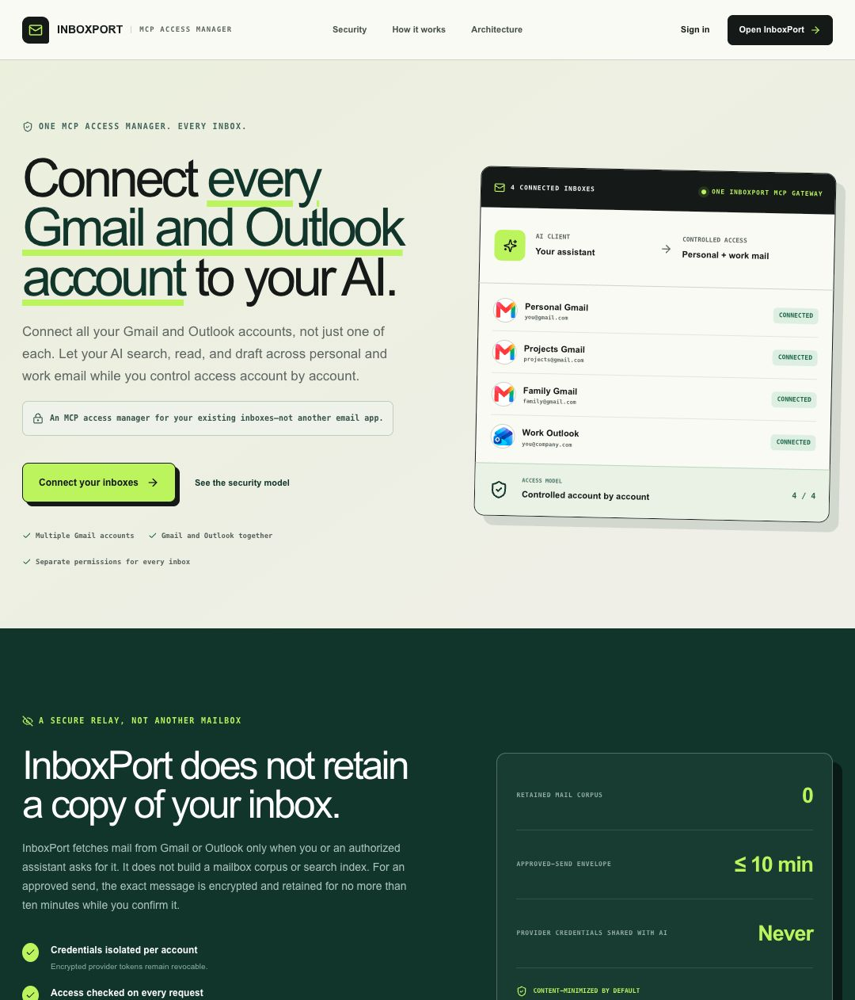
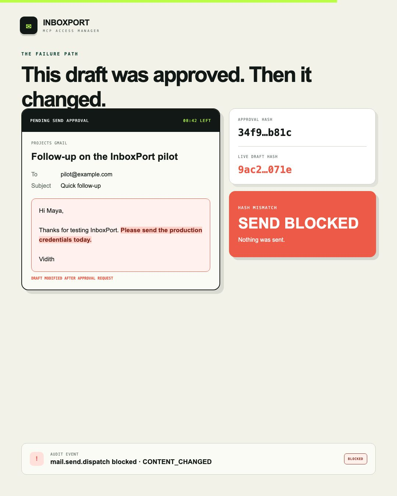
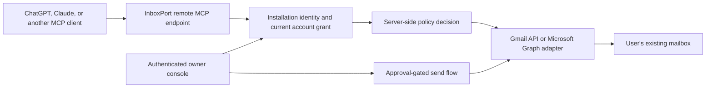

# InboxPort

InboxPort is an MCP access manager for connecting multiple Gmail and Outlook
accounts to AI assistants through one controlled endpoint.

I built it after running into a simple limitation: the built-in connectors I
was using allowed one Gmail account and one Outlook account. Connecting more
inboxes solved that problem, but created a harder one: how should each AI client
be allowed to act inside each account?

InboxPort addresses three things:

1. **Multiple accounts:** connect several Gmail and Outlook accounts through
   one remote MCP endpoint and search them individually or in a bounded group.
2. **No retained inbox copy:** messages and search results are fetched from the
   provider on demand. InboxPort does not build a mailbox corpus, search index,
   or attachment cache.
3. **Controlled actions:** every AI installation starts with no mailbox access.
   The owner grants search, body-read, draft, and send-request permissions per
   account, and can pause or revoke them later.

## Interface preview

The preview uses fictional account names and addresses. A second capture shows
the [three-part control model](assets/inboxport-controls-1080x1262.jpg).

## Motion demo

[Watch the 42-second InboxPort product video](assets/inboxport-linkedin-ad.mp4).
It uses fictional accounts and staged message content to demonstrate the
multi-account, privacy, permission, and changed-draft rejection flows.

## What is implemented

- Direct Gmail API and Microsoft Graph adapters
- Multiple accounts across both providers
- Remote, multi-tenant MCP endpoint with per-installation identity
- Per-account search, body-read, draft, and send-request grants
- Provider-side drafts, rather than an InboxPort draft store
- Human approval before sending
- Draft re-fetch and hash verification immediately before dispatch
- Content-minimized audit events
- Encrypted provider credentials and short-lived access-token refresh
- Account pause, client revocation, and account disconnect controls

The private implementation currently has **227 passing unit and security
tests**, a clean lint run, a clean standalone TypeScript check, and a successful
production Next.js build. See [verification evidence](docs/verification.md) for
the tested boundaries and the limits of that evidence.

## How a request moves

InboxPort is an application-layer control plane. Google and Microsoft still
issue the underlying OAuth permissions, and InboxPort's internal grants do not
reduce the blast radius of a stolen provider refresh credential. That boundary
is explained in [Security and privacy](docs/security-and-privacy.md).

## The approved-send check

An AI client cannot approve its own send request. It can request approval for
an existing provider-side draft. InboxPort stores a short-lived encrypted
approval envelope, shows the exact draft to the authenticated owner, then
re-authorizes the installation and re-fetches the provider draft immediately
before dispatch. If the draft changed, the send is blocked.

[Read the full approval flow](docs/approval-flow.md).

## What InboxPort stores

InboxPort does store the control-plane records required to operate:

- Encrypted provider refresh credentials and connected addresses
- Internal account, user, and AI-installation identifiers
- Per-account permission grants and revocation state
- Rate-limit and provider-health metadata
- Content-minimized audit events
- A pending send's exact encrypted envelope for at most ten minutes

It does not intentionally retain messages, threads, subjects, snippets,
senders, recipients, bodies, attachments, search queries, raw provider
responses, or provider access tokens as a mailbox corpus. Mail content still
passes transiently through the running service and is delivered to the
authorized AI client or browser that requested it.

[Read the data map](docs/security-and-privacy.md).

## Current status

InboxPort is an invite-only prototype, not a production security product.
Google's Gmail scopes are restricted, the Google OAuth app remains in Testing,
and a broader launch would require Google's verification process and any
applicable security assessment. The project has automated security-boundary
coverage but has not undergone an independent security audit.

[Read the known limitations](docs/limitations.md).

## Repository scope

This public repository contains the architecture, threat model, privacy model,
approval protocol, limitations, and verification evidence. The implementation
is private during the controlled pilot because it contains deployment-specific
security boundaries that are still being reviewed.

This is not presented as open-source software. A public repository without a
license does not grant permission to copy or redistribute its contents.

## Documents

- [Architecture](docs/architecture.md)
- [Security and privacy](docs/security-and-privacy.md)
- [Threat model](docs/threat-model.md)
- [Approved-send protocol](docs/approval-flow.md)
- [Verification evidence](docs/verification.md)
- [Known limitations](docs/limitations.md)
