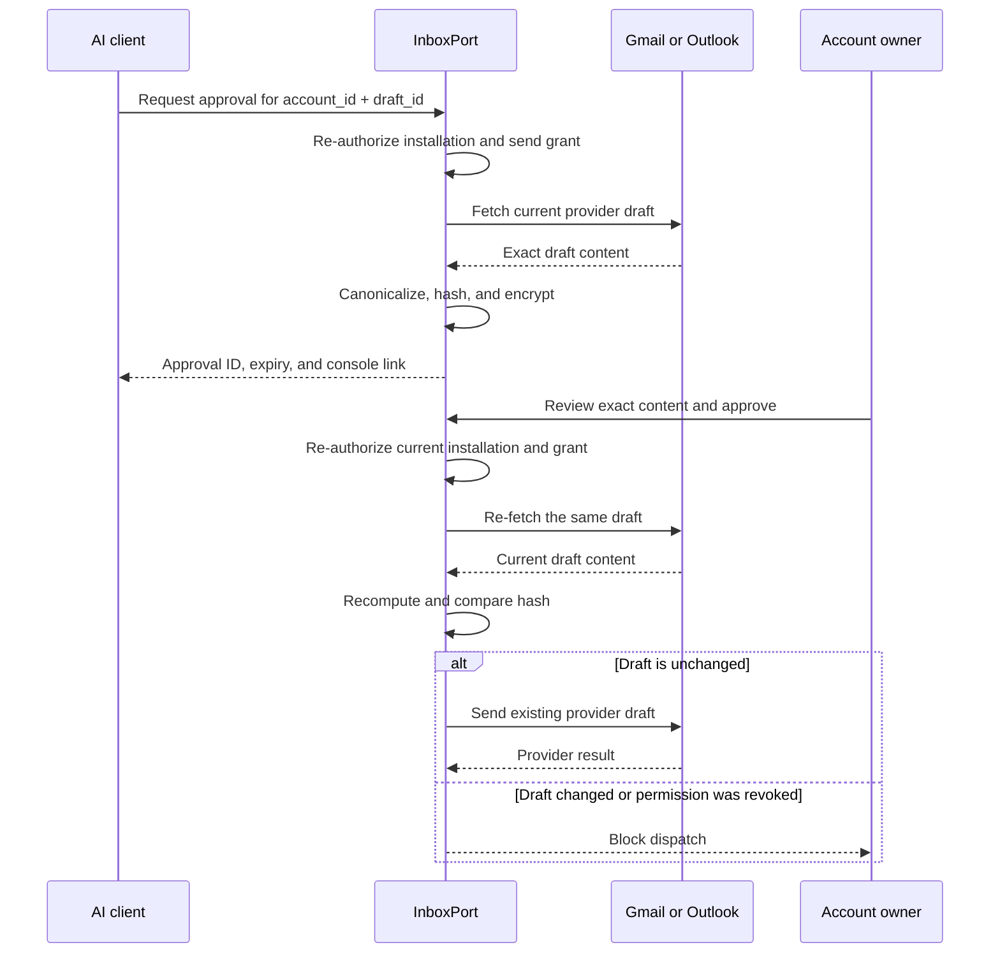

# Approved-send protocol

InboxPort does not give an AI installation a direct send operation. The AI can
create or update a provider-side draft and request human approval to send that
existing draft.

## What is bound into the approval

The canonical hash covers:

- Account identifier
- From address
- To, CC, and BCC recipients
- Subject
- Plain-text body
- HTML body
- Thread identifier
- Attachment presence

Drafts with attachments are rejected in the current release. If a draft has
distinct text and HTML alternatives, the approval preview shows both because
both are included in the hash.

## Lifetime and state

The encrypted approval envelope expires within ten minutes. It can move through
defined states such as awaiting approval, approved, dispatching, sent, denied,
cancelled, failed, or delivery unknown. State transitions are atomic with the
expiry check so an envelope cannot cross into dispatch after its lifetime.

The envelope is deleted when the request is sent, denied, cancelled, or
definitively fails. An ambiguous delivery result is kept only until the same
short expiry so the owner can check the provider's Sent folder. InboxPort never
automatically retries an ambiguous send.

## What this protects against

The check protects against sending content that changed between the approval
request and dispatch, including changes made directly in Gmail or Outlook.

It does not prove that the person approving is free from browser compromise,
that the provider will deliver the message exactly as rendered, or that a
compromised InboxPort runtime cannot misuse a provider credential.

