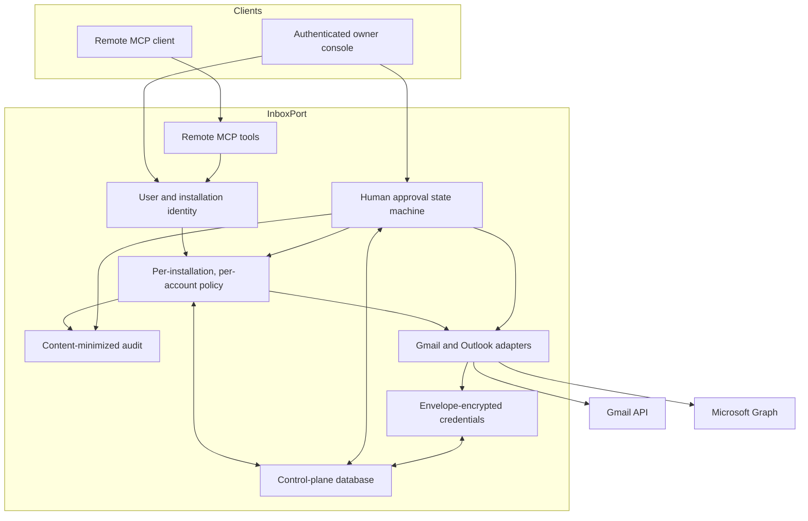

# Architecture

## Objective

InboxPort sits between an MCP client and a user's Gmail or Outlook accounts. It
provides one connection for multiple accounts while keeping authorization and
provider access on the server.

The central design rule is that an AI client's identity is not itself mailbox
permission. Each client installation must receive a separate, current grant for
each connected account and operation.

## Components

## Identity and grants

Each remote MCP connection is represented as an installation. A newly seen
installation starts with zero account grants. The owner can grant any subset of
these operations for an individual account:

- `search`
- `read_body`
- `draft`
- `send`

Every provider operation re-reads the installation, account, grant, pause, and
revocation state. InboxPort does not cache a stale authorization decision
between calls. Multi-account search is bounded and authorizes every requested
account independently.

## Provider boundary

Only the provider adapter can decrypt a provider refresh credential or call
Gmail or Microsoft Graph. Access tokens are refreshed just in time and are not
persisted.

Gmail and Outlook share the policy, audit, repository, and encryption core, but
retain separate provider behavior. For example, Gmail's `gmail.compose` scope
and Microsoft's independent `Mail.ReadWrite` and `Mail.Send` scopes do not map
one-to-one. Outlook also lacks Gmail's simple token-revocation endpoint.

## Live mail path

Search and retrieval are live. InboxPort does not maintain a message corpus or
search index.

1. The user or AI client names an explicit account.
2. InboxPort validates identity and the current account grant.
3. The provider credential is decrypted server-side.
4. A short-lived provider access token is obtained.
5. Gmail or Microsoft Graph returns the requested data.
6. The result is bounded and returned to the requesting client.
7. InboxPort records only content-minimized operational audit data.

Mail content necessarily exists transiently in the provider response, the
running service's memory, the encrypted network connection, and the requesting
client's memory. This is different from retaining a mailbox copy.

## Persistence

The control-plane database stores account records, encrypted refresh
credentials and addresses, installation identities, account grants, revocation
state, rate-limit counters, provider-health state, audit metadata, and
short-lived approval envelopes.

Persistent drafts stay with Gmail or Outlook. The only deliberate persisted
mail-content exception is the encrypted approval envelope described in
[Approved-send protocol](approval-flow.md).

